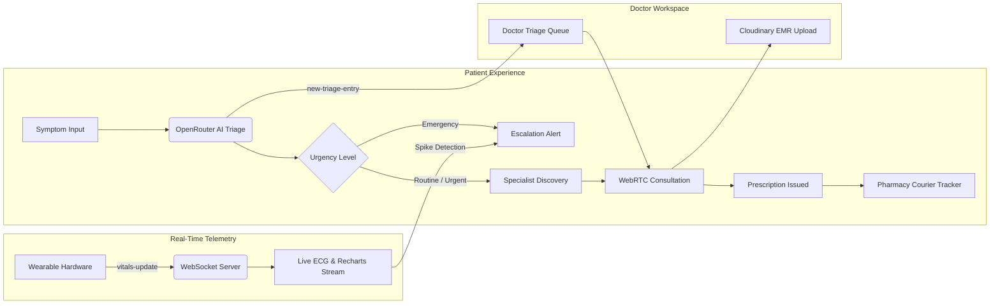

# MediConnect 🏥
### Next-Generation 3D Telehealth & AI-Powered Healthcare Accessibility Platform

<p align="center">
  
</p>

<p align="center">
  <a href="#-main-features--architecture"></a>
  <a href="https://react.dev/"></a>
  <a href="https://nodejs.org/"></a>
  <a href="https://expressjs.com/"></a>
  <a href="https://webrtc.org/"></a>
  <a href="https://socket.io/"></a>
  <a href="https://tailwindcss.com/"></a>
  <a href="LICENSE"></a>
</p>

---

## 📖 Executive Summary

**MediConnect** is an enterprise-grade, real-time Telemedicine and AI Clinical Decision Support Platform designed to eliminate friction across every stage of the healthcare journey. By merging frontier language models with peer-to-peer WebRTC video channels, continuous biometric telemetry streaming, and tamper-proof electronic medical record (EMR) archiving, MediConnect delivers a unified, HIPAA-aware virtual clinic directly inside the browser.

---

## 🌟 5 Core Technical Features & Architecture



### 1. 🤖 AI Symptom Checker & Real-Time Doctor Triage Queue
* **Clinical Intelligence:** Patients describe their discomfort in plain natural language. The backend coordinates with **OpenRouter** frontier models (LLaMA 3, Claude 3.5, Gemini Pro) configured with strict medical triage system prompts.
* **Structured Risk Indexing:** Returns structured JSON containing urgency classification (`EMERGENCY_RED_FLAG`, `URGENT_EVALUATION`, `MODERATE_MONITORING`, `ROUTINE`), probable conditions, and recommended clinical actions.
* **WebSocket Triage Pipeline:** Every assessment is recorded in the MongoDB `TriageQueue` and immediately broadcasts a `new-triage-entry` Socket.io event to active clinicians' dashboards for instantaneous case claiming.

### 2. 📹 Native HTML5 WebRTC P2P Telehealth
* **Browser-Native Consultation:** Direct peer-to-peer encrypted media stream established via native `RTCPeerConnection` without requiring browser extensions or third-party client downloads.
* **Signaling Protocol:** Socket.io orchestrates SDP handshake negotiation (`offer` and `answer`) and dynamic ICE candidate route discovery.
* **Security & Privacy:** Media frames are cryptographically secured using DTLS-SRTP and AES-256-GCM. Supplementary LiveKit integration is supported for multi-party clinical conferences.

### 3. 🫀 Live Wearables Dashboard & Telemetry Studio
* **Continuous Biometric Monitoring:** Monitors physiological indicators (Heart Rate, SpO₂, Blood Pressure, Respiration Rate) at 60 FPS.
* **WebSocket Ingestion:** Consumes real-time hardware telemetry streams emitted over the `vitals-update` socket channel.
* **Algorithmic Spike Detection:** Client-side Recharts and physiological ECG canvas render P-Q-R-S-T cardiac cycles, automatically flagging tachycardia, bradycardia, or hypoxia events to prompt attending clinician alerts.

### 4. 🗄️ Immutable Electronic Medical Records (EMR) Vault
* **Decentralized Record Management:** Unified repository for laboratory diagnostics, digital prescriptions, radiographic imaging, and clinical encounter notes.
* **Role-Based Storage:** Encrypted file uploads handled via Multer and Cloudinary, mapped strictly to patient MongoDB ObjectIds.
* **Audit Integrity:** Employs verifiable SHA-256 checksum hashing for tamper-evident record verification, complying with HIPAA Security & Privacy mandates.

### 5. 📍 Pharmacy Geolocation & Prescription Delivery Tracker
* **Proximity Matching:** Ingests patient coordinates and executes Haversine distance computations against verified partner pharmacy networks.
* **Live Medication Inventory:** Real-time stock queries confirm availability of prescribed therapeutics prior to routing.
* **Courier Dispatch Radar:** Visual step progression tracks prescription dispatch from issuance to doorstep delivery (`Rx Transmitted` → `Pharmacist Verification` → `Courier En Route` → `Handover Confirmed`).

---

## 🎨 Modern 3D Visual Engine

The platform features an ultra-responsive, 60 FPS mathematical 3D visual engine on the landing page:
* **Interactive 3D Bio-Constellation Canvas (`Hero3DScene.jsx`):** Renders rotating 3D DNA double-helixes, synaptic neural meshes, and biometric vortexes with dynamic cursor parallax and zero external heavy 3D library overhead.
* **3D Perspective Tilt Cards (`Tilt3DCard.jsx`):** Multi-layered cards with dynamic specular cursor spotlights and `transform-style: preserve-3d` depth layering.
* **Real-Time CRT Medical Oscilloscope (`ECGCanvas.jsx`):** Physiological electrocardiogram sweep line with phosphorescent CRT glow running at 60 FPS.

---

## 👥 Role-Based Access Control (RBAC)

| Capability / Resource | Patient (`patient`) | Clinician (`doctor`) | Administrator (`admin`) |
| :--- | :---: | :---: | :---: |
| **AI Symptom Checker & Triage** | ✅ Submit & View | ✅ Full Queue & Claim | ✅ System Audit |
| **P2P Video Consultations** | ✅ Attend Room | ✅ Host & Transcribe | ✅ Session Telemetry |
| **Wearable Vitals Stream** | ✅ Personal Stream | ✅ Multi-Patient Grid | ✅ Anomaly Logs |
| **EMR Records Management** | 👁️ Read-Only Vault | ✅ Upload & Sign Rx | ✅ Full Governance |
| **Appointment Ledger** | ✅ Book & Cancel | ✅ Schedule & Accept | ✅ Conflict Resolution |
| **Pharmacy & Delivery Hub** | ✅ Select & Track | 👁️ Issue Route | ✅ Partner Directory |

---

## 🛠️ Technology Stack

```
MediConnect
├── Frontend Client
│   ├── React 19.2 (Fiber Architecture)
│   ├── Vite 8.0 (ESBuild & Rolldown Engine)
│   ├── TailwindCSS 3.4 (Obsidian & Cyber-Emerald System)
│   ├── Framer Motion 12 & GSAP 3 (Fluid Spring Micro-Interactions)
│   ├── Recharts 3.8 (Physiological Graphing)
│   ├── Leaflet & React-Leaflet 5.0 (Geospatial Mapping)
│   └── Lucide React (Clinical Iconography)
│
├── Backend Server
│   ├── Node.js 20+ LTS & Express 4
│   ├── MongoDB & Mongoose ODM (Data Persistence)
│   ├── Socket.io 4.8 (Real-Time Bidirectional Event Mesh)
│   ├── Native HTML5 WebRTC (RTCPeerConnection Signaling)
│   ├── JWT (JSON Web Tokens) & Bcrypt (Cryptographic Auth)
│   ├── Multer & Cloudinary SDK (HIPAA-Safe Media Ingestion)
│   └── OpenRouter API / OpenAI SDK (Multi-LLM Neural Triage)
```

---

## 📁 Repository Directory Structure

```bash
mediconnect/
├── client/                     # Frontend Client Application
│   ├── src/
│   │   ├── components/
│   │   │   ├── 3d/             # 3D Canvas, Tilt Cards & ECG Oscilloscope
│   │   │   │   ├── Hero3DScene.jsx
│   │   │   │   ├── Tilt3DCard.jsx
│   │   │   │   └── ECGCanvas.jsx
│   │   │   ├── landing/        # Interactive Landing Page Studios
│   │   │   │   ├── InteractiveTriage3D.jsx
│   │   │   │   ├── TelehealthSimulator3D.jsx
│   │   │   │   ├── VitalsTelemetry3D.jsx
│   │   │   │   ├── DoctorBooking3D.jsx
│   │   │   │   ├── SecurityVault3D.jsx
│   │   │   │   └── PharmacyDelivery3D.jsx
│   │   │   ├── ui/             # Core Design System Primitives
│   │   │   ├── AIChatbot.jsx
│   │   │   ├── PharmacyFinder.jsx
│   │   │   └── DeliveryTracker.jsx
│   │   ├── pages/              # Primary Routed Views & Dashboards
│   │   │   ├── LandingPage.jsx
│   │   │   ├── PatientDashboard.jsx
│   │   │   ├── DoctorDashboard.jsx
│   │   │   ├── AdminDashboard.jsx
│   │   │   ├── VideoConsultation.jsx
│   │   │   └── MedicalRecords.jsx
│   │   ├── context/            # Global Authentication & Session Context
│   │   ├── index.css           # 3D Presets & Obsidian Aesthetic Tokens
│   │   └── vite.config.js      # Production Build Configuration
│   └── package.json
│
├── server/                     # Backend API & WebSocket Server
│   ├── controllers/            # Request Handlers (Auth, Triage, Records, Appointments)
│   ├── middleware/             # Role Verification & JWT Protection
│   ├── models/                 # Mongoose Schema Definitions (User, Triage, Record, Appointment)
│   ├── routes/                 # RESTful Endpoints (/api/v1/*)
│   ├── services/               # OpenRouter, Socket.io, Cloudinary Adapters
│   ├── index.js                # Server Entrypoint & WebSocket Orchestrator
│   └── package.json
│
├── API.md                      # Comprehensive REST API Specification
├── DEPLOYMENT.md               # Cloud Production Deployment Guide
├── SECURITY.md                 # Security Best Practices & Compliance Documentation
└── README.md                   # Primary Project Documentation
```

---

## 🚀 Quick Start Guide

### Prerequisites
* **Node.js**: `v20.0.0` or higher
* **npm**: `v10.0.0` or higher
* **MongoDB**: Local daemon running or MongoDB Atlas cluster URI
* **API Keys**: OpenRouter (or Gemini) and Cloudinary credentials

### Step 1: Clone Repository
```bash
git clone https://github.com/Sachinxcode-01/MediConnect.git
cd MediConnect
```

### Step 2: Configure Environment Variables

Create `.env` in the `server/` directory:
```env
PORT=5000
NODE_ENV=development
CLIENT_URL=http://localhost:3000

# Database
MONGO_URI=mongodb://127.0.0.1:27017/mediconnect

# Authentication
JWT_SECRET=your_super_secret_256_bit_jwt_key
JWT_EXPIRE=30d

# AI Triage Engine
OPENROUTER_API_KEY=your_openrouter_api_key

# Cloud Media Storage (EMR Vault)
CLOUDINARY_CLOUD_NAME=your_cloud_name
CLOUDINARY_API_KEY=your_cloudinary_api_key
CLOUDINARY_API_SECRET=your_cloudinary_api_secret
```

Create `.env` in the `client/` directory:
```env
VITE_API_URL=http://localhost:5000
```

### Step 3: Install Dependencies
```bash
# Install Server Dependencies
cd server
npm install

# Install Client Dependencies
cd ../client
npm install
```

### Step 4: Launch Development Servers
```bash
# Terminal 1: Start Backend Server
cd server
npm run dev

# Terminal 2: Start Frontend Client
cd client
npm run dev
```

Navigate to **`http://localhost:3000`** in your browser.

---

## 🔒 Security & Regulatory Compliance

* **HIPAA Compliance:** Data transmission adheres to HIPAA Technical Safeguards (§ 164.312). Consultations occur over encrypted DTLS-SRTP WebRTC peer connections.
* **Zero-Knowledge Architecture:** Stored clinical documents and prescriptions require authenticated JWT session tokens with role validation; intermediate relays cannot decrypt media streams.
* **Audit Trail Verifiability:** Digital medical records feature cryptographic SHA-256 hashing to guarantee non-repudiation and prevent retroactive tampering.

For complete vulnerability reporting and security policies, refer to [SECURITY.md](file:///c:/Users/kalin/.gemini/antigravity/scratch/mediconnect/SECURITY.md).

---

## 🤝 Contributing

We welcome contributions to elevate healthcare accessibility!
1. Fork the Project repository.
2. Create your Feature Branch (`git checkout -b feature/clinical-telemetry`).
3. Commit your changes (`git commit -m 'feat: introduce automated arrhythmia alert'`).
4. Push to the Branch (`git push origin feature/clinical-telemetry`).
5. Open a Pull Request.

---

## 📄 License

Distributed under the **MIT License**. See `LICENSE` for more information.

<p align="center">
  <b>MediConnect</b> • Built with dedication for universal healthcare accessibility.
</p>
