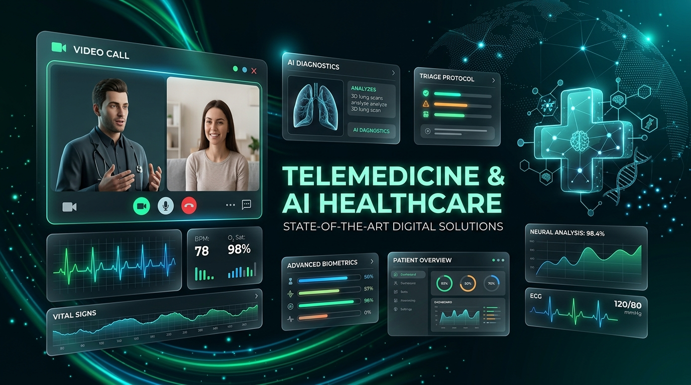

# MediConnect 🏥

<p align="center">
  
</p>

MediConnect is an AI-powered, real-time Healthcare Accessibility & Telemedicine Platform. It bridges the gap between patients and medical professionals by integrating cutting-edge technologies like WebRTC for live telehealth consultations, AI for medical symptom triage, WebSocket events for live wearable data streaming, and MongoDB for secure electronic medical records (EMR).

## 🌟 Main Features & How They Work

### 1. 🤖 AI Symptom Checker (Triage System)
* **What it does:** Allows patients to input their symptoms in plain language to get an immediate assessment.
* **How it works:** When a patient submits symptoms on the dashboard, the backend makes an API call to **OpenRouter**, allowing us to utilize elite frontier models like LLaMA 3 and Claude instantly. The AI is prompt-engineered to act as a medical triage assistant. It parses the symptoms, returning a structured JSON containing the severity level (e.g., critical, high, medium), possible conditions, and recommended actions.
* **Process Flow:** Patient submits symptoms -> Express API sends data via OpenAI SDK to OpenRouter -> Model returns JSON -> Saved to `TriageQueue` in MongoDB -> Emits a real-time Socket.io event (`new-triage-entry`) alerting connected doctors.

### 2. 📹 Real-Time P2P Telehealth (WebRTC)
* **What it does:** Allows patients and doctors to enter a secure, encrypted peer-to-peer video consultation room directly in the browser—no third-party apps required.
* **How it works:** Built using native **HTML5 WebRTC (`RTCPeerConnection`)** and **Socket.io**.
* **Process Flow:** User joins room -> Socket.io signals presence to the other peer -> Caller creates an SDP `offer` -> Callee receives and generates an SDP `answer` -> Both parties exchange `ice-candidate` network routes -> Secure P2P encrypted media stream is established.

### 3. 🫀 Live Wearables Dashboard
* **What it does:** Monitors patient vitals (Heart Rate, SpO2) in real-time, instantly alerting the patient and their doctor of critical spikes.
* **How it works:** A streaming graph built with **Recharts** listens continuously to a WebSockets channel. 
* **Process Flow:** The backend simulates wearable hardware by firing generic vitals data through the `vitals-update` socket channel. The frontend graph dynamically appends this data to the chart, visually rendering health spikes immediately.

### 4. 🗄️ Immutable Medical Records Vault
* **What it does:** A secure hub where patients can view their lab results, prescriptions, and visit summaries, while doctors can upload new EMR files.
* **How it works:** Records are mapped via a `Record` model in MongoDB linked tightly to the user's `ObjectId`.
* **Process Flow:** Doctor uploads a record securely via Multer/Cloudinary -> Secure Express endpoint validates the JWT Role -> Record saved to DB with safe file URL -> Patient fetches `/api/records` returning only authorized documents linked to their ID.

### 5. 📍 Pharmacy Geolocation Interface
* **What it does:** Connects patients to nearby pharmacies so they can pick up their prescriptions easily.
* **How it works:** Uses simulated backend-to-Google Places API integration mapping coordinates to generic nearby pharmacies to showcase functionality without incurring billing costs.

---

## 👥 User Steps & Workflows

### For Patients:
1. **Sign Up/Login:** Create an account via the landing page. Your role defaults to `patient`.
2. **Dashboard Overview:** Land on your private dashboard to see upcoming appointments and recent updates.
3. **Check Symptoms:** Navigate to the "Symptom Checker", type "severe headache and blurry vision", and receive an immediate AI analysis.
4. **Telehealth Call:** Click the "Telehealth" tab to connect your camera. Wait in the encrypted room for your doctor to join the session.
5. **Review Records:** After the call, open "Medical Records" to view and download the latest visit summary uploaded by the doctor.

### For Doctors:
1. **Login:** Log in with a `doctor` account (via DB seed).
2. **Review Triage Queue:** Doctors have elevated access to view the `TriageQueue` populated by the AI, sorted automatically by critical severity.
3. **Host Telehealth:** Join the identical Telehealth room. The system automatically bridges the P2P connection to process the medical consultation.
4. **Issue Records:** Post-call, navigate to the Medical Records tab, click "Upload New", and push a Lab Result or Prescription to the patient's vault.

---

## 🛠️ Technical Architecture & Setup

### Tech Stack
* **Frontend:** React 19, Vite, TailwindCSS (Custom Light-Green UI Design System), Recharts, Lucide Icons, Socket.io-client.
* **Backend:** Node.js, Express, MongoDB (Mongoose), Socket.io, JWT Authentication.
* **Integrations:** OpenRouter API (via OpenAI SDK), Cloudinary, Native WebRTC.

### Quick Start
1. **Install Dependencies:**
   ```bash
   cd server && npm install
   cd client && npm install
   ```
2. **Environment Variables:**
   - Server (`server/.env`): Needs `MONGO_URI`, `JWT_SECRET`, `CLIENT_URL`, `OPENROUTER_API_KEY`. (Also CLOUDINARY keys for file uploads)
   - Client (`client/.env`): Needs `VITE_API_URL` pointing to backend.
3. **Run the Application:**
   ```bash
   # Terminal 1
   cd server && npm run dev
   # Terminal 2
   cd client && npm run dev
   ```
